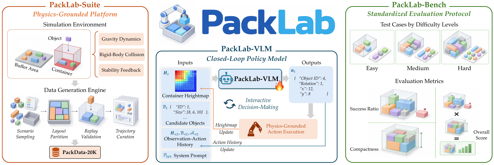

<h1 align="center" style="line-height: 50px;">
  PackLab: A Comprehensive Framework for Developing, Training, and Evaluating MLLMs in Robotic Bin Packing
</h1>

<div align="center">
Donghao Zhou<sup>1,*</sup>, Jia-Hui Pan<sup>1,*</sup>, Fan Zhang<sup>1</sup>, Xingyuan Bu<sup>2</sup>, Shilong Li<sup>2</sup>, Xiaojie Gao<sup>1</sup>,<br>
Yun-Hui Liu<sup>3</sup>, Chi-Wing Fu<sup>1,†</sup>, and Pheng-Ann Heng<sup>1,†</sup>
</div>

<br>

<div align="center">
<sup>1</sup>Department of Computer Science and Engineering, The Chinese University of Hong Kong<br>
<sup>2</sup>M-A-P<br><sup>3</sup>Department of Mechanical and Automation Engineering, The Chinese University of Hong Kong
</div>

<br>


<div align="center">
<sup>*</sup>Equal contribution, <sup>†</sup>Corresponding authors
</div>


<br>

<div align="center">
  <a href="https://github.com/Correr-Zhou/PackLab"></a> &ensp;
  <a href="https://huggingface.co/donghao-zhou/PackLab-VLM-9B"></a> &ensp;
  <a href="https://huggingface.co/datasets/donghao-zhou/PackData-20K"></a> &ensp;
  <a href="https://huggingface.co/datasets/donghao-zhou/PackLab-Bench"></a>
</div>

---

PackLab is a comprehensive framework for developing, training, and evaluating multi-modal large language models for closed-loop robotic bin packing. It contains **PackLab-Suite**, a physics-based simulation platform for generating diverse packing trajectories and evaluating physical outcomes; **PackLab-VLM-9B**, a packing-specialized MLLM that reasons over object geometries and evolving container states to select objects and predict placements; and **PackLab-Bench**, a standardized benchmark with multiple difficulty levels for systematic evaluation.

<div align="center">
  
</div>

https://github.com/user-attachments/assets/ddbd31e3-3c45-4baf-aa21-e00f87de473d

## 🛠️ Environment Setup

Create a clean Python environment from the cloned repository root and install the package dependencies:

```bash
git clone https://github.com/Correr-Zhou/PackLab.git
cd PackLab
conda create -n packlab python=3.10 -y
conda activate packlab
pip install -r requirement.txt
git clone https://github.com/volcengine/verl.git verl
cd verl && git checkout 5a2eed1c5265841aa1b92c809a685bd9d46fe461 && pip install -e .
cd ..
```

For local runs, set the project path before launching scripts:

```bash
export PYTHONPATH="$PWD:${PYTHONPATH:-}"
```

The training scripts use `verl.trainer.sft_trainer`. The release was validated with `verl` commit `5a2eed1c5265841aa1b92c809a685bd9d46fe461`; keep `verl` in `./verl` at that commit and do not modify its source code.

## 📦 Data, Benchmark, and Checkpoint

The default configs expect all assets inside the cloned repository:

```text
PackLab/
  benchmarks/PackLab-Bench/
  checkpoints/PackLab-VLM-9B/
  data/PackData-20K/
  verl/
```

Download the released assets:

```bash
huggingface-cli download donghao-zhou/PackLab-VLM-9B --local-dir checkpoints/PackLab-VLM-9B
huggingface-cli download donghao-zhou/PackData-20K --repo-type dataset --local-dir data/PackData-20K
huggingface-cli download donghao-zhou/PackLab-Bench --repo-type dataset --local-dir benchmarks/PackLab-Bench
```

Extract the PackData-20K height-map image archives before training:

```bash
cd data/PackData-20K
for difficulty in easy medium hard; do
  for archive in images/${difficulty}/*.tar; do
    tar -xf "${archive}"
  done
done
cd ../..
```

The default base model for SFT is `Qwen/Qwen3.5-9B`. You can override it with `MODEL_PATH`.

## 🚀 Training

Run SFT with the released training config:

```bash
MODEL_PATH=Qwen/Qwen3.5-9B \
OUTPUT_DIR=outputs/checkpoints/packlab_vlm_9b_sft \
bash scripts/train_sft.sh
```

Common overrides:

```bash
NPROC_PER_NODE=8 \
SFT_TRAIN_BATCH_SIZE=8 \
SFT_MICRO_BATCH_SIZE_PER_GPU=1 \
SFT_LR=1e-5 \
SFT_EPOCHS=10 \
bash scripts/train_sft.sh
```

The released PackData-20K package contains the training split. To evaluate during SFT with your own validation parquet files, pass them through `SFT_VAL_FILES` using colon-separated paths.

For a minimal one-step run:

```bash
NPROC_PER_NODE=1 \
SFT_TOTAL_TRAINING_STEPS=1 \
SFT_SAVE_FREQ=1 \
OUTPUT_DIR=outputs/checkpoints/packlab_sft_minimal \
bash scripts/train_sft.sh
```

## 📊 Evaluation

Evaluate PackLab-VLM-9B on PackLab-Bench:

```bash
MODEL_PATH=checkpoints/PackLab-VLM-9B \
RUN_NAME=packlab_bench \
bash scripts/evaluate.sh
```

For a one-case evaluation:

```bash
MODEL_PATH=checkpoints/PackLab-VLM-9B \
RUN_NAME=packlab_bench_one_case \
bash scripts/evaluate.sh data.max_cases=1
```

The evaluator writes `metrics.json`, `cases.jsonl`, and `resolved_config.yaml` under `outputs/eval/<run_name>/`.

If you already have an OpenAI-compatible chat-completions server, run evaluation without launching a local vLLM server. The server must expose `/v1/chat/completions` and accept multimodal chat messages:

```bash
BASE_URL=http://127.0.0.1:8000/v1 \
MODEL_PATH=checkpoints/PackLab-VLM-9B \
RUN_NAME=packlab_bench_openai \
bash scripts/evaluate_openai.sh
```

Use `API_KEY`, `OPENAI_API_KEY`, or `PACKLAB_OPENAI_API_KEY` when the endpoint requires authentication.

## 🧩 Custom Data Generation

The released PackData-20K and PackLab-Bench assets are sufficient for the default training and evaluation commands above. The data-generation scripts are provided for users who want to generate their own packing trajectories or benchmark splits.

Generate PackData-style SFT shards:

```bash
bash scripts/build_dataset.sh
```

Useful shard controls:

```bash
NUM_SHARDS=100 START_SHARD=0 END_SHARD=9 SKIP_COMPLETED=1 bash scripts/build_dataset.sh
```

Generate PackLab-Bench-style evaluation cases:

```bash
bash scripts/build_benchmark.sh
```

Both commands accept Hydra-style overrides. For example, this creates a tiny custom SFT dataset:

```bash
bash scripts/build_dataset.sh \
  output_dir=outputs/tiny_packdata \
  generation.per_difficulty.easy.num_episodes=1 \
  generation.per_difficulty.medium.num_episodes=0 \
  generation.per_difficulty.hard.num_episodes=0 \
  val_generation.per_difficulty.easy.num_episodes=1 \
  val_generation.per_difficulty.medium.num_episodes=0 \
  val_generation.per_difficulty.hard.num_episodes=0
```

## 🎬 Visualization

Export model action sequences from an evaluation run:

```bash
CASES=outputs/eval/packlab_bench/cases.jsonl \
bash scripts/export_action_sequences.sh
```

Replay the action sequences and render visualizations:

```bash
ACTION_SEQUENCES=outputs/eval/packlab_bench/action_sequences.jsonl \
OUTPUT_DIR=outputs/visualization/packlab_bench \
bash scripts/visualize.sh
```

## 🤝 Acknowledgements

We thank the contributors of [verl](https://github.com/volcengine/verl), [PyBullet](https://pybullet.org), [vLLM](https://github.com/vllm-project/vllm), and the open-source MLLM ecosystem for making this release possible.

This study was funded by the InnoHK initiative of the Innovation and Technology Commission of the Hong Kong Special Administrative Region Government via the Hong Kong Centre for Logistics Robotics.

## 🔗 Citation

If PackLab is helpful for your research or projects, please consider citing our work:

```bibtex
@article{zhou2026packlab,
  title={PackLab: A Comprehensive Framework for Developing, Training, and Evaluating MLLMs in Robotic Bin Packing},
  author={Zhou, Donghao and Pan, Jia-Hui and Zhang, Fan and Bu, Xingyuan and Li, Shilong and Gao, Xiaojie and Liu, Yun-Hui and Fu, Chi-Wing and Heng, Pheng-Ann},
  journal={arXiv preprint},
  year={2026}
}
```

## 📬 Contact

For questions about PackLab, please contact Donghao Zhou at [dhzhou@link.cuhk.edu.hk](mailto:dhzhou@link.cuhk.edu.hk).
